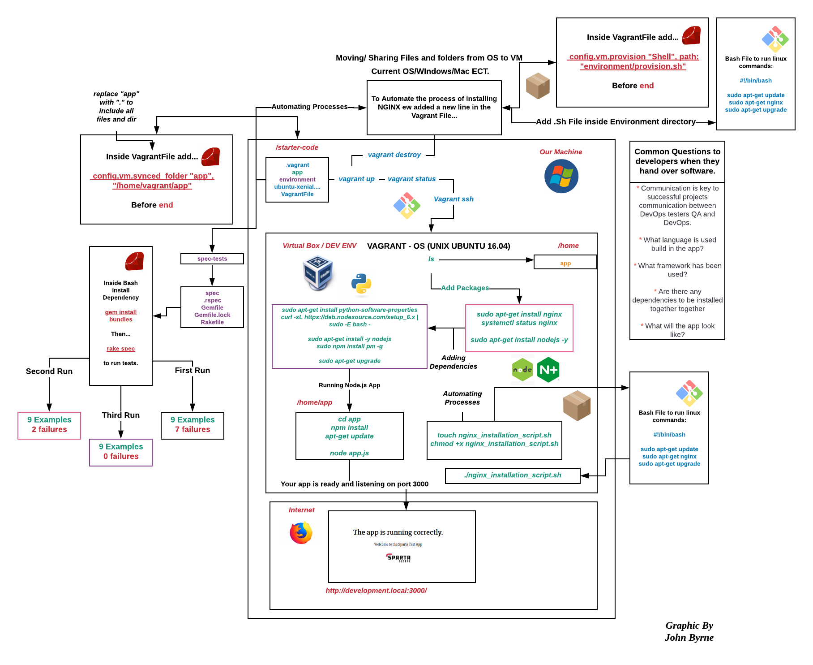

# Vagrant

## What is Vagrant

- Vagrant is a Vagrant is a tool for building and managing virtual machine environments in a single workflow 
with an easy-to-use workflow and focus on automation.

## How to open and use Linux Virtual Machine Step By Step

- First open git bash and make your way to the folder where the vagrant file is located,
On my PC this is C:\vagrant

- Then within this folder do 'vagrant up', which runs our VM

- We can run 'vagrant status' which would tell us the status of our VM

- Once the VM is running we then use 'vagrant ssh' which is what allows us to access the VM

### Other commands that can be run on our vagrant file
- vagrant halt -- This pauses the VM

- vagrant destroy -- this command is used to stop the running of the VM and remove traces
of the VM on our system

- vagrant reload -- This reruns the VM, thus if we have made changes to the vagrant
file we would need to reload the VM to see those changes in effect

Note that Vagrant files are written in Ruby

Once inside the VM, the operating system is Linux and thus linux commands must be used

## Common Linux Commands

- "nano nameoffile" --> allows entry inside of a file and then edit it

- "touch nameoffile" --> allows the creation of a file in

- "rm nameoffile" --> deleting a file(may have to use sudo for admin usage)

- "mkdir nameofdirectory" -->create a directory

- "cd nameofdir" Entry inside a directory 

- "cd -" --> Exit a directory

- "cd /" --> Return to the root directory

- echo "hello" --> Print on the command line 

- "sudo su" --> Change to the root user

- "exit" --> Return back to normal user 
 
- "id" --> Check who is using the machine
 
Sudo works by allowing us to run a command in admin

- "pwd" --> Shows the current file location

- "ls" --> Checking contents of the current directory

"ls -a" Searching for hidden files in a directory

- "uname" --> Displays name of operating system'

sudo apt-get update -y

This command can be broken down and explained

- sudo means the command will be run at the root user
- apt-get is a package manager where we can update/install packages
- -y means that means we will not be prompt whether we want to download something or not, the default is yes
apt-get install nginx
apt-get already has many packages available so it is able to install nginx for us
if it cannot find nginx, it will look online to find the program on specific directories

"systemctl status nginx" --> Check the status of the installed program -- 
nginx is a web server that allows us to launch live websites, connecting to
IP's etc

When we search in a website we don't type in a IP address, we have a website name

